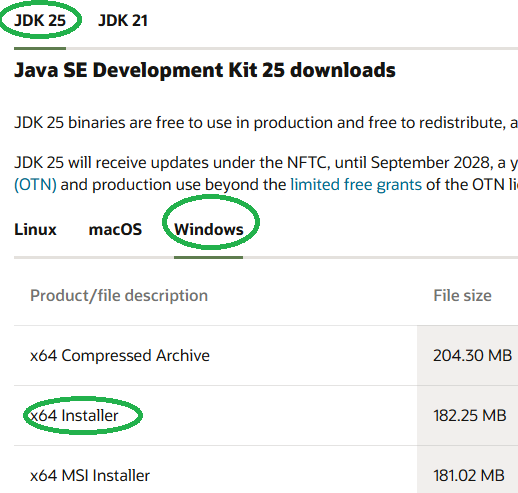
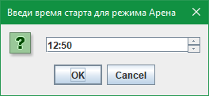
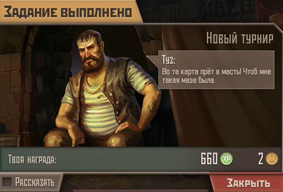

======================================
M E T R O B O T   v1.00
======================================

Назначение:
------------
Программа "MetroBot" — это автоматический помощник-кликер для браузерной Flash-игрушки Метро 2033. Работает с игровыми 
приложениями в соцсетях МойМир и ВКонтакте.
Программа кликает вместо игрока по заранее определённым координатам кнопок и выдерживает паузы до следующей серии
кликов. Для удобства повседневной работы за компьютером, после серии кликов программа сворачивает игровые окна, а через 
~5 минут снова разворачивает их для очередного сражения. В это время можно полноценно использовать ПК.

Поддерживается до 4 игровых окон (бойцов). Возможна работа только с выбранными окнами из числа открытых.
Например, когда в одном из окон активирован VIP-режим, то нет смысла автоматизации режима Арена: игра сама проводит 
автобои.

В версии 1.0 доступны следующие режимы:
- бои на Арене;
- бои в Клановых войнах;
- участие в Рейдах;
- набивание туннельных монстров (Ящеров и Пауков) в Туннелях.

Об игре:
------------ 
"Метро 2033" - это не знаменитая 3D-игра с сиквелами, а примитивная игрушка класса "Моя любимая ферма".
Основана на книгах матёрого экстремиста Дмитрия Глуховского, игра написана при его участии.
Большинство задач игры сводятся к 5-10 кликам раз в 5 минут, что у активного игрока занимает по 5..6 часов в сутки.

--------------------------------------
До запуска программы МетроБот
--------------------------------------
Программа написана на языке Java. Чтобы запустить её, требуется скачать и установить JDK (Java Development Kit) отсюда:
https://www.oracle.com/java/technologies/downloads/
Нужна версия для Windows x64.

Запустите установщик, нажимайте Next и т.п.
В процессе установки убедитесь, что стоит галочка “Set JAVA_HOME variable” — это нужно, чтобы система знала, где лежит 
Java.

--------------------------------------
Основные функции
--------------------------------------
- Автоматически разворачивает и сворачивает нужные окна.
- Нажимает правильные кнопки ("Атаковать", "Пропустить", "Закрыть", и т.д.).
- Считает количество боёв, чтобы не допустить расход игровых жетонов.
- Сохраняет конфигурацию предыдущего запуска (активные окна, время стартов и режим).

--------------------------------------
Запуск программы МетроБот
--------------------------------------

1. Перед запуском МетроБота убедитесь, что запущены все окна "Игроклуб" (или браузера с игрой ВК).
МетроБот найдёт их самостоятельно, даже если они свёрнуты.
2. Избавьтесь от глючной чёрной полоски, которая находится между заголовком окна Игроклуба и игровым полем. 

Перетащите ползунок окна вниз так, чтобы полоска полностью скрылась из вида (допустимы 2-3 пикселя). 
3. Запустите файл Start.bat.
4. При первом запуске появятся диалоговые окна с выбором режима, активных бойцов, указанием времени старта режимов.

МетроБот развернёт игровые окна в течение 1-2 секунд после установки времени (нажатия ОК в окне выбора времени).

Время старта: ваше местное, не московское.
При выборе времени старта: если указать прошедшие часы:минуты, то МетроБот начнёт выбранный режим сразу после нажатия
на кнопку Ок. Если указать будущие часы:минуты, то МетроБот стартует выбранный режим в указанное время. 
Для режимов КВ и Рейд рекомендуется устанавливать время старта с запасом в 1 минуту. Например, если КВ начинается в
17:40, то следует установить время старта на 17:41.

--------------------------------------
Режимы игры
--------------------------------------
Для всех режимов:
-	время устанавливайте своё локальное (НЕ московское!);
-	для КВ и Рейдов ставьте время с запасом в 1 минуту. Если движуха начинается в 17:30, то установите 17:31;
-	МетроБот не учитывает сражения, сделанные вами самостоятельно! К примеру, если вы сами настреляли 10 боёв на Арене, 
а затем включили Метробот, то он сделает все 50 доступных боёв, т.е. будет тратить ваши жетоны;

-	чтобы избежать этого, откройте файл counters.txt и вручную добавьте пройденные вами бои. 
Например, если игра говорит, что прошло 9 боёв, то откройте файл и впишите в строку Арена число 9 (без пробелов). 
То же самое про КВ и Рейды.
-	Метробот не умеет закрывать окна-«нежданчики», например – завершённую ежедневку, повышение уровня бойца или питомца,
«аномалии» и т.п. Программа просто игнорирует их. Программа умеет закрывать уведомления о завершённой работе 
у Начальников станций, возвращаясь к кликам.

-	В режимах КВ, Рейд и Арена отсчёт времени идёт до следующего разворота окон, а не до выстрела. 
От разворота до «Атаковать» проходит ещё 3-5 секунд.

1. Клановые войны.
До 24 боёв в автоматическом режиме. Автоматически разворачивает окна до серии кликов, кликает, забирает погон, 
сворачивает окна до следующей пятиминутки. Время старта устанавливайте с запасом в 1 минуту (см. выше).
2. Рейд.
До 12 боёв. Время старта устанавливайте с запасом в 1 минуту (см. выше). Окна разворачиваются и сворачиваются 
автоматически.
3. Арена.
   Проводит до 50 боёв в автоматическом режиме, раз в 5 минут. Разворачивает окна до начала серии кликов
   «Атаковать-Закрыть», кликает, собирает предмет коллекции, сворачивает окна. Не стоит включать этот режим при
   активированном VIP.

   

4. Туннели: набивание туннельных монстров – ящеров и пауков в соответствующих тоннелях. В день доступно 20 пауков 
и 40 ящеров. Этот режим строго требует нахождение бойца на станции Парк Культуры (красные), а также отсутствие работы 
у Начстанции. Боец должен быть готов сразу же выйти в туннели! По окончании режима боец возвращается на станцию 
Парк Культуры (красные). Прохождение режима «Туннели» занимает порядка 45 минут, во время которых нежелательно 
пользоваться ПК: окна не сворачиваются и не разворачиваются, а программа кликает по ним раз в 10-15 секунд.
Разумеется, требуется наличие всех необходимых пропусков вплоть до Проспекта Вернадского. Репутация у фракций не нужна. 
В этом режиме удобно прокачивать питомцев, однако МетроБот пока не умеет закрывать уведомление о достижении питомцем 
следующего уровня.

   
--------------------------------------
Файлы и настройки
--------------------------------------
config.txt - хранит параметры предыдущего запуска программы:
mode=3
activeWindows=1 3
arena_start=20:00
kv_start=21:00

Время местное. Файл можно редактировать вручную, когда программа не запущена.

counters.txt - хранит счётчики работы программы, количество боёв на Арене, в Рейдах и в КВ.
Рейд=0
Арена=36
КВ=22

Файл можно редактировать вручную, когда программа не запущена.

last_reset.txt - хранит дату последнего обнуления счётчиков. При первом запуске программы каждый день после 03:00 Мск,
счётчики обнуляются автоматически.

--------------------------------------
Системные требования
--------------------------------------
- Windows 7 или выше, x64
- Java 21 или выше

--------------------------------------
Автор и благодарности
--------------------------------------
Автор: Алексей Низамов

Благодарности:

Большое спасибо Егору, автору бесплатного Java-курса "Дорогу осилит идущий": 
https://t.me/ViamSupervadetVadens,  и коммьюнити этого курса.
Ссылка на GitHub: https://github.com/KFalcon2022/lessons

Спасибо автору мира Метро-2033 Дмитрию Глуховскому :-)
А также всем тестерам, которые помогали при разработке МетроБота.

--------------------------------------
Контакты и обратная связь
--------------------------------------
Сообщить о проблеме или предложить идею можно через:

e-mail: aleksey.nizamov@gmail.com

Telegram: @LeGrandeMojave
--------------------------------------
(с) 2025