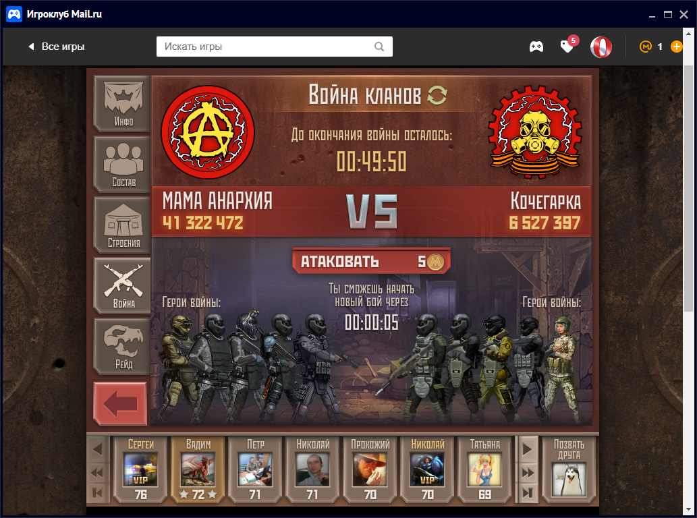
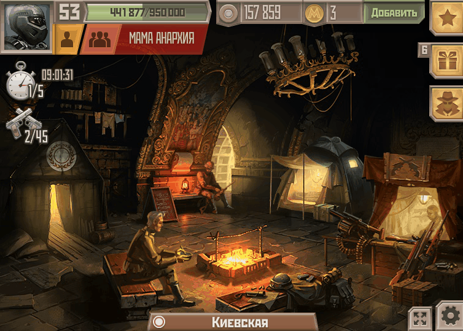
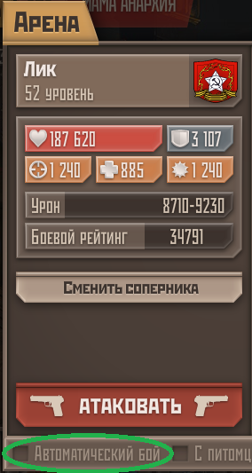

======================================
METROBOT   v1.00
======================================

Назначение:
------------
Программа "MetroBot" — это автоматический помощник-кликер для браузерной Flash-игрушки Метро 2033. Работает с игровыми 
приложениями в соцсетях МойМир и ВКонтакте.
Программа кликает вместо игрока по заранее определённым координатам кнопок и выдерживает паузы до следующей серии
кликов. Для удобства повседневной работы за компьютером, после серии кликов программа сворачивает игровые окна, а через 
~5 минут снова разворачивает их для очередного сражения. В это время можно полноценно использовать ПК.

Поддерживается до 4 игровых окон. Возможна работа только с выбранными окнами из числа открытых. Например, когда в одном
из окон активирован VIP-режим, то нет смысла автоматизации режима Арена: игра сама проводит автобои.

В версии 1.0 доступны следующие режимы:
- бои на Арене;
- бои в Клановых войнах;
- участие в Рейдах;
- набивание туннельных монстров (Ящеров и Пауков) в Туннелях.

Об игре:
------------ 
"Метро 2033" - это не знаменитая 3D-игра с сиквелами, а примитивная игрушка класса "Моя любимая ферма".
Большинство задач игры сводятся к 5-10 кликам раз в 5 минут, что у активного игрока занимает по 5..6 часов в сутки.

--------------------------------------
1. До запуска программы МетроБот
--------------------------------------
Программа написана на языке Java. Чтобы запустить её, требуется скачать и установить JDK (Java Development Kit) отсюда:
https://www.oracle.com/java/technologies/downloads/
Нужна версия для Windows x64.

Если у вас x86 (32-битная) версия Windows, то рекомендую скачать JRE отсюда. Выбираем версию для Windows x32:
https://adoptium.net/temurin/releases/?version=17

:

Запустите установщик, нажимайте Next и т.п.
В процессе установки убедитесь, что стоит галочка “Set JAVA_HOME variable” — это нужно, чтобы система знала, где лежит 
Java.

--------------------------------------
Загрузка программы МетроБот
--------------------------------------

1. Перед запуском МетроБота убедитесь, что запущены все окна "Игроклуб" (или браузера с игрой ВК).
Метробот найдёт их самостоятельно, даже если они свёрнуты.
2. Запустите файл Metrobot.bat.
3. При первом запуске появятся диалоговые окна с выбором режима, активных бойцов, указанием времени старта режимов.

--------------------------------------
Режимы игры
--------------------------------------
1. Клановые войны.
2. Рейд.
3. Арена.
4. Туннели: набивание туннельных монстров (пауки, ящеры и др.) для получения достижений.

--------------------------------------
Основные функции
--------------------------------------
- Автоматически разворачивает и сворачивает нужные окна.
- Нажимает правильные кнопки ("Атаковать", "Пропустить", "Закрыть", и т.д.).
- Считает количество боёв, чтобы не допустить расход игровых жетонов.
- Сохраняет конфигурацию предыдущего запуска (активные окна, время стартов и режим).

--------------------------------------
Файлы и настройки
--------------------------------------
config.txt - хранит параметры предыдущего запуска программы:
mode=3
activeWindows=1 3
arena_start=20:00
kv_start=21:00

Время местное. Файл можно редактировать вручную, когда программа не запущена.

counters.txt - хранит счётчики работы программы, количество боёв"
Рейд=0
Арена=36
КВ=22

Файл можно редактировать вручную, когда программа не запущена.

--------------------------------------
Системные требования
--------------------------------------
- Windows 7 / 10 / 11
- Java 17 или выше

--------------------------------------
Автор и благодарности
--------------------------------------
Автор: Алексей Низамов

Благодарности:
Большое спасибо автору полностью бесплатного Java-курса "Дорогу осилит идущий" и коммьюнити.
Спасибо автору мира Метро-2033 Дмитрию Глуховскому
А также всем тестерам, которые помогали при разработке МетроБота.

--------------------------------------
Контакты и обратная связь
--------------------------------------
Сообщить о проблеме или предложить идею можно через:
e-mail: aleksey.nizamov@gmail.com
Telegram: @LeGrandeMojave
--------------------------------------
(с) 2025

Прога "МетроБот" умеет:
- играть вместо пользователя в трёх наиболее затратных по времени режимах: Арена (порядка 3-4 часов), Клановая война (2 часа) и Рейд (1 час);
- полностью автоматически играть в ещё одном режиме: "поход по тоннелям" ради набивания монстров-ящеров (40 штук в день, порядка 15 минут).
- кликать почти одновременно по 1-4 заданным окнам ("персам");
- сворачивать и разворачивать активные игровые окна, чтобы не слишком прерывать работу пользователя;
- запускать нужный режим игры в заданное пользователем время;
- записывать в файл статистику своей работы и читать её оттуда для последующих запусков.

***
Чему потихоньку учу прогу:
- работать одновременно в нескольких режимах, чтобы их активность не пересекались друг с другом по времени;
- новому режиму "Ежедневные задания";

Помимо прикладных вещей, сделана куча (бес)полезностей ради учёбы и практики, часть пока отключена за ненадобностью:
1. Счётчики, их сохранение и последующее использование.
2. Грамматические поправки выводимых программой сообщений.
3. Работа в разных часовых поясах.
4. Простейший GUI вместо консольного ввода 2-3 параметров.
